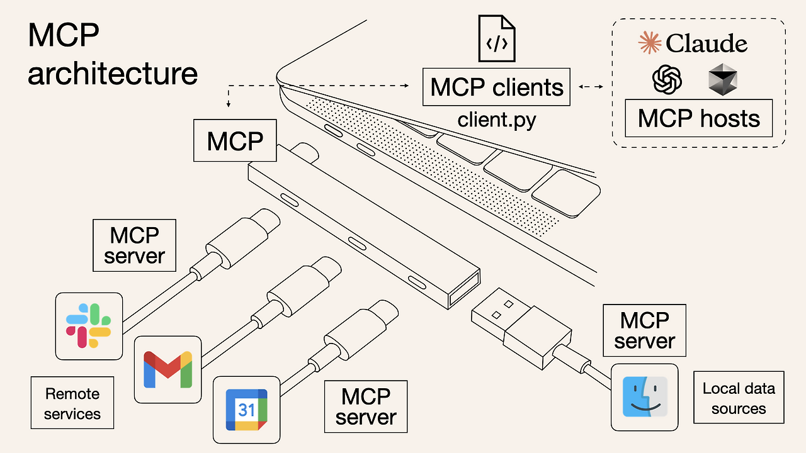

# MCP(Model Context Protocol)

> [참고 자료](https://goddaehee.tistory.com/386)
>
> 1절. MCP
>
> 2절. MCP 동작

## 1절. MCP

### MCP(Model Context Protocol)

- AI 모델과 외부 도구 및 데이터를 연결하는 표준 인터페이스
- **AI 애플리케이션을 위한 USB-C 포트**
- 데이터의 규격을 맞춰 연결하는 것

### USB와의 비교

| 시점 |                          USB-C                           |                        MCP                        |
| :--: | :------------------------------------------------------: | :-----------------------------------------------: |
| 이전 | 프린터, 마우스, 키보드 등 각기 다른 포트와 드라이버 필요 | GitHub, Slack, DB 등 각기 다른 서비스를 AI가 연결 |
| 이후 |               하나의 포트로 모든 기기 연결               |         하나의 표준으로 모든 시스템 연결          |

### 강점

|    특징     | 설명                       |
| :---------: | :------------------------- |
| 실시간 문서 | 최신 공식 문서 즉시 참조   |
| 정확한 버전 | 사용 중인 버전에 맞는 코드 |
| 생산성 향상 | 불필요한 검색 시간 단축    |
| 범용 호환성 | 주요 AI IDE 지원           |

## 2절. MCP 동작

### MCP 아키텍처

|          구조          | 설명                                |
| :--------------------: | :---------------------------------- |
| MCP Client(클라이언트) | Claude Desktop 같은 AI 애플리케이션 |
|    MCP Server(서버)    | GitHub, Slack, DB 등 시스템의 서버  |
|     표준 프로토콜      | JSON-PRC로 대화                     |

### MCP 동작 흐름

|    프로세스     | 설명                                |
| :-------------: | :---------------------------------- |
| 클라이언트 요청 | AI 에이전트에 특정 작업 요청        |
|   호스트 중재   | 요청 검토 후 적절한 서버로 라우팅   |
|    서버 처리    | 외부 데이터 소스에서 최신 정보 수집 |
|  컨텍스트 주입  | 수집된 정보를 AI 컨텍스트에 삽입    |
|    응답 생성    | 최신 정보 기반으로 정확한 코드 제안 |

### MCP 장점

|         장점         | 설명                                           |
| :------------------: | :--------------------------------------------- |
|     생산성 폭증      | 개발 속도 증가(디버깅 시 특히 증가)            |
| 컨텍스트 스위칭 감소 | 툴 간 이동이 줄어 집중력 향상                  |
|        표준화        | 한 번 설정 시 다른 MCP 서버들도 쉽게 추가 가능 |
|         보안         | OAuth와 기존 권한 체계 사용으로 안전           |

### MCP 보안

- 고려사항

|   위험 요소   | 설명                                                  |
| :-----------: | :---------------------------------------------------- |
|   생성 단계   | 악의적인 서버가 정상 서버로 위장해 백도어를 심을 위험 |
|   운영 단계   | 서버가 허용 범위를 벗어나 시스템에 접근할 위험        |
| 업데이트 단계 | 업데이트 후에도 이전 권한이 남거나 설정이 변경될 위험 |

### MCP 보안 수착

- 공식 저장소에서만 서버 설치(npm, GitHub 등)
- 서버 별 최소 권한 원칙과 적용
- 정기적으로 서버 목록과 권한 검토
- 로컬 서버보다는 검증된 원격 서버 우선 사용
- 의심스러운 서버는 샌드박스 환경에서 먼저 테스트
