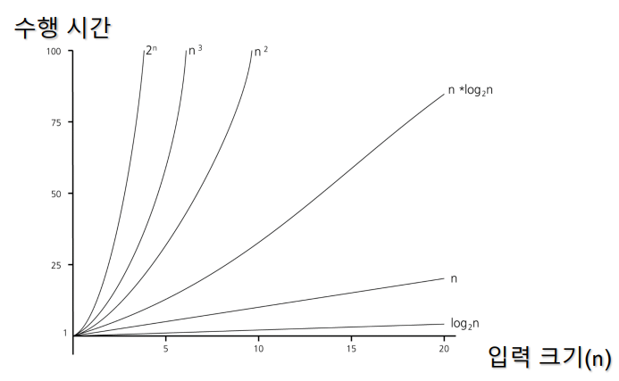
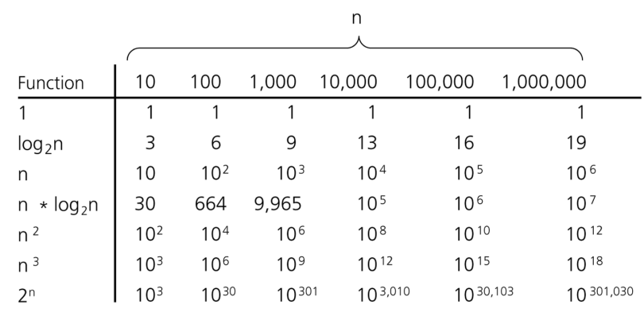

# 알고리즘(Algorithm)

> 1절. 정의
>
> 2절. 효율성
>
> 3절. 수행시간
>
> 4절. Extra
>
> 5절. Summary

## 1절. 정의

### 알고리즘(Algorithm)

- 문제 해결, 연산 수행을 위해 필요한 일련의 단계적 **절차**나 **규칙**
- 알고리즘이 해결하는 문제 : 입력과 출력 명시
  - 입력 -> 알고리즘 -> 출력

| 요소 |  특성  |
| :--: | :----: |
| 입력 | 유한성 |
| 출력 | 명확성 |
|      | 효율성 |

## 2절. 효율성

### 효율성(Efficiency)

- 입력 크기가 커질수록 중요성 증가
- 효율적인(efficient) 알고리즘 작성 시 고려 요소
  - 수행 시간
  - 메모리
- 알고리즘의 수행시간은 입력 크기를 기반으로 특정 비율로 소요
  - N : 입력 크기

- 수행 시간 예시

| 수행 시간 |     기호     |
| :-------: | :----------: |
|  1(상수)  |    $O(1)$    |
|    $N$    |    $O(N)$    |
|   $N^2$   |   $O(N^2)$   |
|   $N^3$   |   $O(N^3)$   |
|  $log N$  |  $O(log N)$  |
| $N log N$ | $O(N log N)$ |
|   $2^n$   |   $O(2^N)$   |

## 3절. 수행시간

### 알고리즘 특정 비율 별 수행 시간





### 상수 시간 : $O(1)$

- $n$에 관계 없음
- 상수 시간 소요

```python
# 1번 수행

def sample1(A, n):
  k = n // 2
  return A[k]
```

### $n$에 비례하는 시간 소요 : $O(N)$

- $n$에 비례

```python
# n의 크기만큼 수행

def sample2(A, n):
  sum = 0
  for i in range(1, n):
    sum += A[i]
  return sum
```

### $n^2$에 비례하는 시간 소요 : $O(N^2)$

- $n^2$에 비례

```python
# n * n만큼 수행

def sample3(A, n):
  sum = 0
  for i in range(1, n):
    for j in range(1, n):
      sum += (A[i] * A[j])
  return sum

# 예시
print(sample3([1, 2, 3, 4, 5], 4))

# 출력
81
```

### $n^3$에 비례하는 시간 소요 : $O(N^3)$

- $n^3$ 의 값에 비례하는 시간 소요

```python
# n * n * n만큼 수행

def sample4(A, n):
  sum = 0
  for i in range(1, n):
    for j in range(1, n):
      # k <- A[1...n]에서 임의 floor(n/2)개 중 최댓값
      sum += k
  return sum
```

#### Q1. sample5 함수의 수행 시간 ?

```python
def sample5(A, n):
  sum = 0
  for i in range(1, n):
    for j in range(1 + 1, n):
      sum += A[i] * A[j]
  return sum
```

- $n^2$에 비례하는 수행 시간
  - A[i], A[j]를 가져올 경우 상수 시간 $O(1)$ 소요
  - range(1, 5) × range(2, 5)  
     = $(n - 1) × (n - 2) $   
  = $n^2 - 3n + 2$ = $O(n^2)$

## 4절. Extra

### 이진 탐색(Binary Search)

- 오름차순 정렬 전제
- $O(log n)$에 비례

```python
def binary_search(arr, target):
  low = 0
  high = len(arr) - 1

  while low <= high:
    mid = (low + high) // 2

    if arr[mid] == target:
      return mid
    elif arr[mid] < target:
      low = mid + 1
    else:
      high = mid - 1
  return -1
# 어느 것도 찾지 못한 경우 -1 리턴
```

### 재귀(Recursion)

- 문제 안에 문제가 존재하는 경우
- ex) factorial 함수

```Python
def factorial(n):
  if n == 1: return 1
  return n * factorial(n - 1)
```

- factorial(n) 함수는 $O(N)$에 비례

### 병합 정렬의 재귀

```Python
# A[p ... r]을 정렬
def mergeSort(A, p, r):
  if (p < r):
    q = floor((p + r)/2)
    # p, r의 중간 지점 계산

    mergeSort(A, p, q)    # 전반부 정렬
    mergeSort(A, q+1, r)  # 후반부 정렬
    merge(A, p, q, r)     # 병합

def merge(A, p, q, r):
  # 정렬된 배열 A[p ... q]와 A[q+1 ... r] 병합
  # 하나의 배열 A[p ... r] 생성
```

### 재귀 정리

- 프로그램의 크기가 작고 간단하게 표현 가능
- stack에서 복잡한 push, pop 연산으로 많은 메모리 사용
- 속도 저하 가능성 존재
- loop 사용 추천

## 5절. Summary

### 알고리즘 본질

- 명확한 **입력**을 받아 모호하지 않은 단계(**명확성**)을 거쳐 유한한 시간 내에 반드시 **출력**을 내는 효율적인 절차
- UI(화면)나 외부 의존성을 배제해 데이터 연산과 변환에만 집중하는 **순수 로직**

### 시간 복잡도

- 데이터의 크기(N)가 커질 때 최고 차수만 남고 상수는 제외

| 기호(Big-O)  |      명칭      | 특징                                      | 예시                                     |
| :----------: | :------------: | :---------------------------------------- | :--------------------------------------- |
|    $O(1)$    |   상수 시간    | 데이터 크기에 상관 없는 최고 효율성       | 배열 인덱스 조회                         |
|  $O(log N)$  |   로그 시간    | 데이터 크기가 증가해도 소요시간은 안정적  | 이진 탐색(Binary Search)                 |
|    $O(N)$    |   선형 시간    | 데이터 크기만큼 비례하게 증가             | 단일 루프문                              |
| $O(N log N)$ | 선형 로그 시간 | 효율적 정렬 알고리즘 표준 속도            | 병합 정렬(Merge Sort)                    |
|   $O(N^2)$   |    2차 시간    | 데이터가 많아지면 시스템 부하 발생        | 이중 중첩 루프문, 버블 정렬(Bubble Sort) |
|   $O(N^3)$   |    3차 시간    | 데이터가 조금만 많아져도 시스템 사용 불가 | 삼중 중첩 루프문                         |

### 알고리즘 기반 코드 설계

#### 중첩 루프 경계

- 루프 내 다른 탐색 발생 시 차수가 곱해짐
  - $O(N^2)$, $O(N^3)$
  - 구조 개선 필요

#### 재귀(Recursion) 사용 주의

- 재귀는 직관적인 코드를 가짐
  - 팩토리얼, 병합 정렬
- 실무에서는 메모리(Memory) 스택 오버플로우나 속도 저하 유발 가능
- 반복문(Loop)으로 우회 추천
