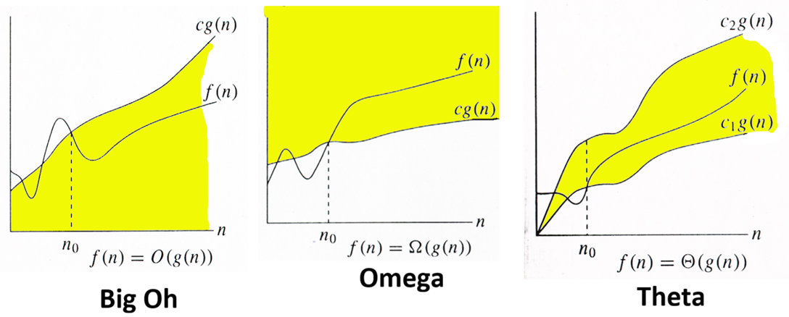
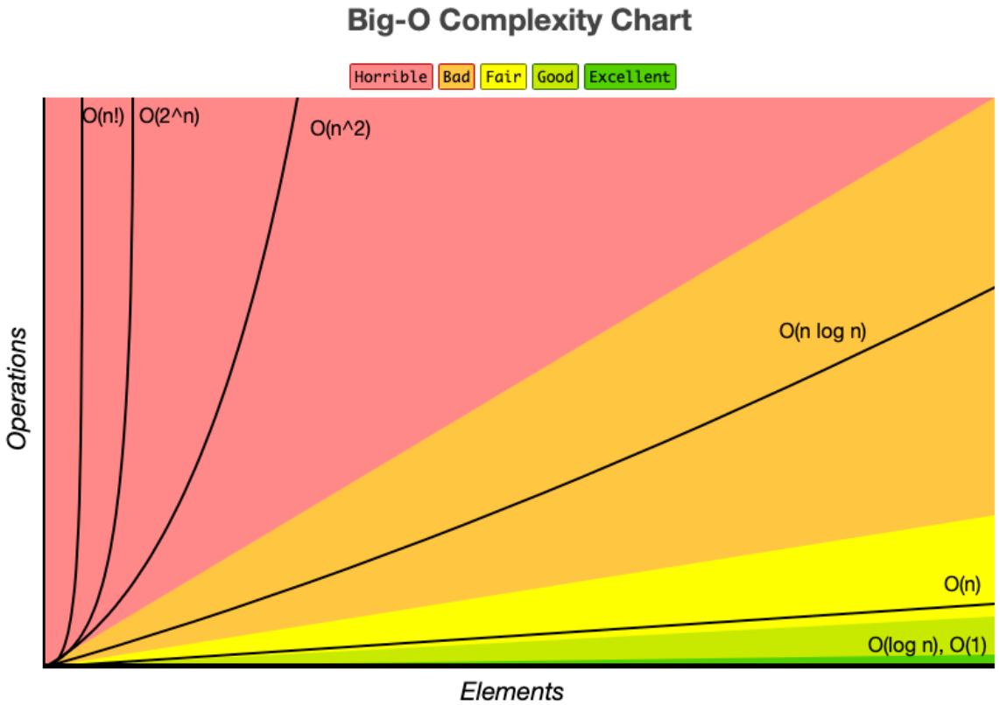

# 점근적 분석(Asymptotic Analysis)

> 1절. 점근적 분석
>
> 2절. 점근법 표기
>
> 3절. Summary

## 1절. 점근적 분석

### 배경

| 입력 크기 | 효율성 |
| :-------: | :----: |
|   작음    | 중요 X |
|    큼     |  중요  |

### 점근적 분석

- 입력 크기가 큰 경우 분석
- $\displaystyle \lim_{ n\to \infty }f(n)$
- $Ο, Ω, Θ, ω, O$ 표기법

### 점근적 표기법 정리

- 주로 빅오($O$)와 세타($\Theta$) 사용

|   기호   | 명칭                          |   부등호 비유   | 의미                                                                  |
| :------: | :---------------------------- | :-------------: | :-------------------------------------------------------------------- |
|   $O$    | 빅오 (Big-O)               | $\le$ (이하) | **점근적 상한선** 아무리 최악이어도 이 시간 이하 소모              |
| $\Omega$ | 빅오메가 (Big-Omega)       | $\ge$ (이상) | **점근적 하한선** 아무리 최선이어도 최소 이 시간 이상 소모         |
| $\Theta$ | 세타 (Theta)               |  $=$ (동급)  | **정확한 범위** 빅오와 빅오메가가 같을 경우 소모                   |
|   $o$    | 리틀 오 (little-o)         |  $<$ (미만)  | **엄격한 상한선** 빅오에서 등호가 빠진 개념으로 확실히 더 빠름     |
| $\omega$ | 리틀 오메가 (little-omega) |  $>$ (초과)  | **엄격한 하한선** 빅오메가에서 등호가 빠진 개념으로 확실히 더 느림 |

## 2절. 점근법 표기

### $O(g(n))$

- 점근적 증가율이 $g(n)$을 넘지 않는 모든 함수
- 상한이자 최악

| 예제 | 공식           |  표기법  |
| :--: | :------------- | :------: |
| ex 1 | $2n^2+100n$    | $O(n^2)$ |
| ex 2 | $5n$ $log$ $n$ | $O(n^2)$ |
| ex 3 | $5n^3- 1000n$  | $O(n^3)$ |

#### 수학적 정의

$\{O(g(n))={f(n)|\exists c > 0, n_0 > 0, s.t.\forall n \geq n_0, f(n) \leq cg(n)}\}$

### $\Omega(g(n))$

- 점근적 증가율이 적어도 $g(n)$이 되는 모든 함수
- 하한이자 최선

| 예제 | 공식           |  표기법  |
| :--: | :------------- | :------: |
| ex 1 | $2n^2+100n$    | $Ω(n^2)$ |
| ex 2 | $5n$ $log$ $n$ |  $Ω(n)$  |
| ex 3 | $5n^3- 1000n$  | $Ω(n^2)$ |

#### 수학적 정의

$\{Ω(g(n))={f(n)|\exists c > 0, n_0 > 0, s.t.\forall n \geq n_0, f(n) \geq cg(n)}\}$

### $\Theta(g(n))$

- 점근적 증가율이 $g(n)$과 일치하는 모든 함수
- 점근적 동치(Asymptotically Tight Bound)
- $\Theta (g(n)) = O(g(n))\cap \Omega (g(n))$

| 예제 | 공식           |      표기법       |
| :--: | :------------- | :---------------: |
| ex 1 | $2n^2+100n$    |   $\Theta(n^2)$   |
| ex 2 | $5n$ $log$ $n$ | $\Theta(n log n)$ |
| ex 3 | $5n^3- 1000n$  |   $\Theta(n^3)$   |

#### 수학적 정의

$\{\Theta(g(n))={f(n)|\exists c, d > 0, n_0 > 0, s.t.\forall n \geq n_0, cg(n) \leq f(n) \leq dg(n)}\}$

### 점근적 표기 그래프

### 빅오(O) 복잡도 차트

### 정렬 알고리즘 복잡도

|         정렬 알고리즘         | 분류 (제자리 여부) | 시간 복잡도                                                                                           | 공간 복잡도       |
| :---------------------------: | :-------------------: | :---------------------------------------------------------------------------------------------------- | ----------------- |
|    퀵 정렬 (Quick Sort)    |       In-place        | 최선 : $\Omega(n$ $log$ $(n))$ 평균 : $\Theta(n$ $log$ $(n))$ 최악 : $O(n^2)$                   | 최악 : $O(n)$     |
|   병합 정렬 (Merge Sort)   |     Not In-place      | 최선 : $\Omega(n$ $log$ $(n))$ 평균 : $\Theta(n$ $log$ $(n))$ 최악 : $O(n$ $log$ $(n))$         | 최악 : $O(n)$     |
|     팀 정렬 (Tim Sort)     |     Not In-place      | 최선 : $\Omega(n)$ 평균 : $\Theta(n$ $log$ $(n))$ 최악 : $O(n$ $log$ $(n))$                     | 최악 : $O(n)$     |
|     힙 정렬 Heap Sort      |       In-place        | 최선 : $\Omega(n$ $log$ $(n))$ 평균 : $\Theta(n$ $log$ $(n))$ 최악 : $O(n$ $log$ $(n))$         | 최악 : $O(1)$     |
|  버블 정렬 (Bubble Sort)   |       In-place        | 최선 : $\Omega(n)$ 평균 : $\Theta(n^2)$ 최악 : $O(n^2)$                                         | 최악 : $O(1)$     |
| 삽입 정렬 (Insertion Sort) |       In-place        | 최선 : $\Omega(n)$ 평균 : $\Theta(n^2)$ 최악 : $O(n^2)$                                         | 최악 : $O(1)$     |
| 선택 정렬 (Selection Sort) |       In-place        | 최선 : $\Omega(n^2)$ 평균 : $\Theta(n^2)$ 최악 : $O(n^2)$                                       | 최악 : $O(1)$     |
|   트리 정렬 (Tree Sort)    |     Not In-place      | 최선 : $\Omega(n$ $log$ $(n))$ 평균 : $\Theta(n$ $log$ $(n))$ 최악 : $O(n^2)$                   | 최악 : $O(n)$     |
|    쉘 정렬 (Shell Sort)    |       In-place        | 최선 : $\Omega(n$ $log$ $(n))$ 평균 : $\Theta(n$ $(log$ $(n))^2)$ 최악 : $O(n$ $(log$ $(n))^2)$ | 최악 : $O(1)$     |
|  버킷 정렬 (Bucket Sort)   |     Not In-place      | 최선 : $\Omega(n + k)$ 평균 : $\Theta(n + k)$ 최악 : $O(n^2)$                                   | 최악 : $O(n)$     |
|   기수 정렬 (Radix Sort)   |     Not In-place      | 최선 : $\Omega(nk)$ 평균 : $\Theta(nk)$ 최악 : $O(nk)$                                          | 최악 : $O(n + k)$ |
| 계수 정렬 (Counting Sort)  |     Not In-place      | 최선 : $\Omega(n+k)$ 평균 : $\Theta(n+k)$ 최악 : $O(n+k)$                                       | 최악 : $O(k)$     |
|   큐브 정렬 (Cube Sort)    |     Not In-place      | 최선 : $\Omega(n)$ 평균 : $\Theta(n$ $log(n))$ 최악 : $O(n$ $log(n))$                           | 최악 : $O(n)$     |

### 점근적 표기 예제

| 예제 | 공식       |    표기법     |
| :--: | :--------- | :-----------: |
| ex 1 | $5n^2$     |   $O(n^2)$    |
| ex 2 | $5n + 3$   |    $O(n)$     |
| ex 3 | $5n^2$     | $\Omega(n^2)$ |
| ex 4 | $5n^3 + 3$ | $\Omega(n^3)$ |
| ex 5 | $5n^2$     | $\Theta(n^2)$ |

## 3절. Summary

### 시간 복잡도 분석 정리

|     경우     |     표기법     | 설명            |
| :----------: | :------------: | :-------------- |
|  Worst Case  |   $O(g(n))$    | 비관적인 복잡도 |
| Average Case | $\Theta(g(n))$ | 이상적인 복잡도 |
|  Best Case   | $\Omega(g(n))$ | 낙관적인 복잡도 |

> **주의** : $O$, $\Omega$, $\Theta$는 본래 "함수의 점근적 상한·하한·동치"를 뜻하는 표기이지, 그 자체로 최악·최선·평균을 의미하지는 않는다. 위 표는 "최악의 경우 실행 시간의 상한을 $O$로, 최선의 경우 실행 시간의 하한을 $\Omega$로 즐겨 표기한다"는 관례를 정리한 것이다. 예를 들어 최선의 경우 실행 시간도 $O$로 상한을 표기할 수 있다.
