# Chapter 8. 레드 블랙 트리(Red-Black Tree)

> 0절. 개요
>
> 1절. 레드 블랙 트리
>
> 2절. 삽입
>
> 3절. 삭제
>
> 4절. 코드 구현

## 0절. 개요

### Red - Black 트리

|                       조건                        |
| :-----------------------------------------------: |
|           모든 노드는 블랙 or 레드 노드           |
|                 루트 노드는 블랙                  |
|               리프 노드(NIL)는 블랙               |
|            레드 노드 자식은 블랙 노드             |
| 루트 노드 -> 리프 노드 경로의 블랙 노드 수는 동일 |

## 1절. 레드 블랙 트리

### 레드 블랙 트리 구현

- NIL 노드 처리

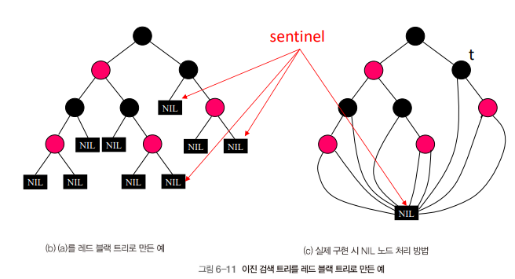

### 레드 블랙 트리 요구사항

1. 각 노드는 색 저장을 위한 한 비트의 저장소 필요
2. 가장 긴 PATH(root에서 가장 먼 NIL)의 길이는 가장 짧은 PATH(root에서 가장 가까운 NIL)의 길이 2배를 넘지 못함

> 가장 짧은 PATH : 모든 블랙 노드  
> 가장 긴 PATH : 레드 노드와 블랙 노드가 번갈아 나옴

### 동작

- 레드 블랙 트리의 특성이 깨질 수 있는 동작의 경우 회전(rotation)을 통한 레드 블랙 트리 특성 유지 필요
- 공간 복잡도 : $O(n)$

|     종류     | rotation 여부 |  수행 시간   |
| :----------: | :-----------: | :----------: |
| 검색(Search) |       X       | $O(log n)$ |
| 삽입(Insert) |       O       | $O(log n)$ |
| 삭제(Delete) |       O       | $O(log n)$ |

### 회전(Rotation)

- 서브 트리 위치 조정으로 트리 구조 변경
- 키의 순서에 영향 X
- 목표 : 트리 높이 감소
  - 최대 높이 : $O(log$ $n)$
  - 큰 서브 트리 : 위
  - 작은 서브 트리 : 아래

### 레드 블랙 트리 간 관계

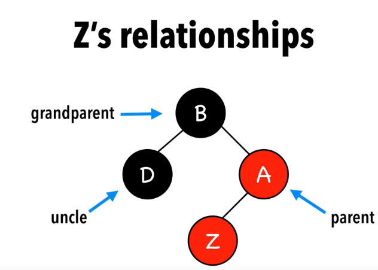

- Z 노드 기준 관계
  - Parent
  - Uncle
  - Grandparent

## 2절. 삽입

### 삽입 전략(Insert Strategy)

| 전략                                                      |
| :-------------------------------------------------------- |
| 노드 삽입 시 레드 노드                                    |
| 규칙 위반 시 노드 색상 변경(Recoloring) or 회전(Rotation) |

### 삽입 시나리오

|       시나리오 종류       | 설명                                            |
| :-----------------------: | :---------------------------------------------- |
|         Z = root          | 노드가 루트 노드인 경우                         |
|       Z.uncle = red       | 노드.uncle이 레드 노드인 경우                   |
| Z.uncle = black(Triangle) | 노드.uncle이 블랙 노드이며 Triangle 형태인 경우 |
|   Z.uncle = black(Line)   | 노드.uncle이 블랙 노드이며 Line 형태인 경우     |

### Z = root

1. 삽입된 Z는 레드 노드
2. Z를 블랙 노드로 교체

### Z.uncle = red

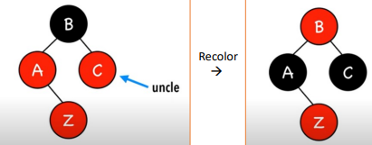

1. 삽입된 Z는 레드 노드
2. Z의 Parent, Uncle, Grandparent 모두 Recoloring
   - Parent : red -> black
   - Uncle : red -> black
   - Grandparent : black -> red

### Z.uncle = black(Triangle)

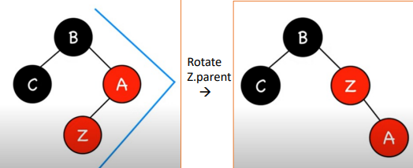

1. 삽입된 Z는 레드 노드
2. Z의 Parent와 Rotation

### Z.uncle black(Line)

| 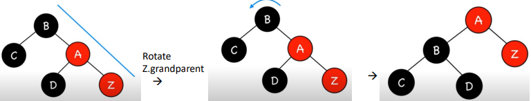 | 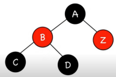 |
| ---------------------------------------------------------------------------------------------------------------------------------- | ----------------------------------------------------------------------------------------------------------------------------------- |

1. 삽입된 Z는 레드 노드
2. Z의 Parent 기준 Rotation
3. Z의 Parent, Uncle 모두 Recoloring
   - Parent : red -> black
   - Uncle : black -> red

### 시나리오 결과 요약

|       시나리오 종류       | 결과                           |
| :-----------------------: | :----------------------------- |
|         Z = root          | Color Black                    |
|       Z.uncle = red       | Recoloring                     |
| Z.uncle = black(Triangle) | Rotate Z.parent                |
|   Z.uncle = black(Line)   | Rotate Z.grandparent & recolor |

#### ex 1 : 기본 삽입

- 15, 5, 1 삽입

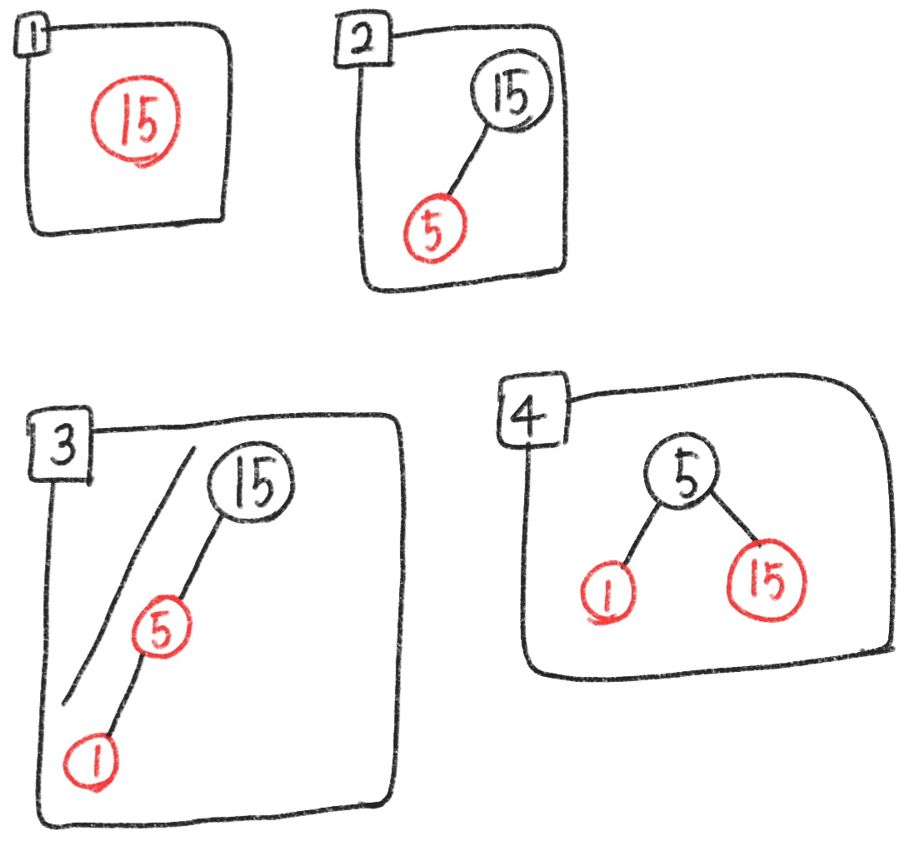

#### ex 2 : 심화 삽입 (1)

- 10 삽입

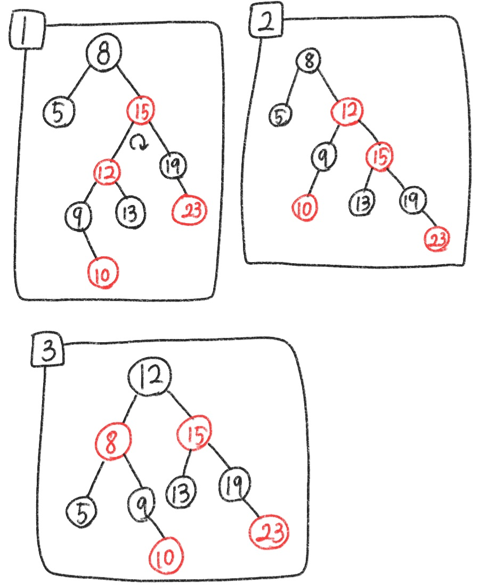

#### ex 3 : 심화 삽입 (2)

- 3, 1, 5, 7, 6, 8, 9, 10 순서의 삽입

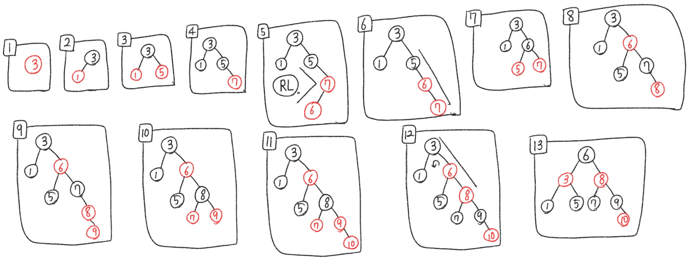

## 3절. 삭제

### 삭제 전략(Delete Strategy)

| 전략                                                                                     |
| :--------------------------------------------------------------------------------------- |
| 노드 삭제 후 주변의 레드 블랙 특성 위반 여부 확인                                        |
| 두 개의 자식을 가진 노드 삭제 작업의 경우 자식이 없거나 하나인 노드의 삭제 작업으로 변환 |

### 단순 삭제

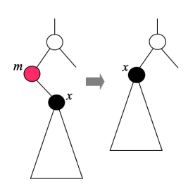

- 삭제 노드가 레드 노드인 경우

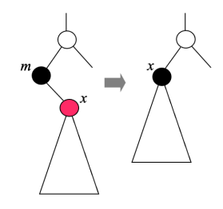

- 삭제 노드가 블랙 노드이면서 자식 노드가 레드 노드인 경우

### 심화 삭제

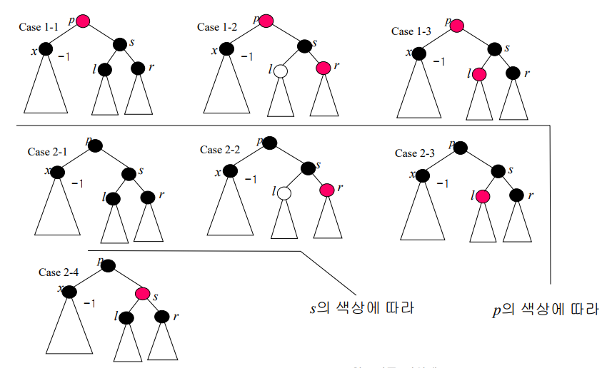

- 블랙 노드 제거 시 x에서 리프 노드로 이르는 블랙 노드의 수가 상이
  - 레드 블랙 특성 위반 가능성 존재

### 심화 삭제 5가지

| 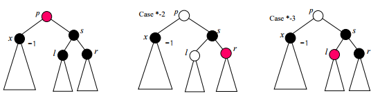 | 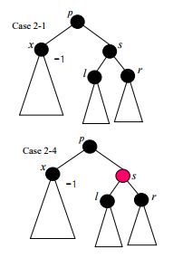 |
| ------------------------------------------------------------------------------------------------------------------------------ | ------------------------------------------------------------------------------------------------------------------------------ |

1. 루트 노드가 레드 노드인 경우
2. 루트 노드가 레드 / 블랙 노드 여부가 상관 없는 경우
3. 루트 노드가 블랙 노드인 경우

### 루트 노드가 레드 노드인 경우

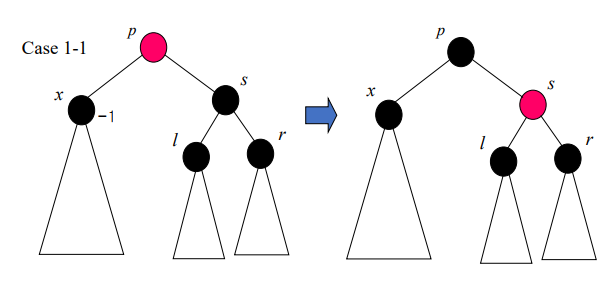

### 루트 노드가 레드 / 블랙 노드 여부가 상관 없는 경우

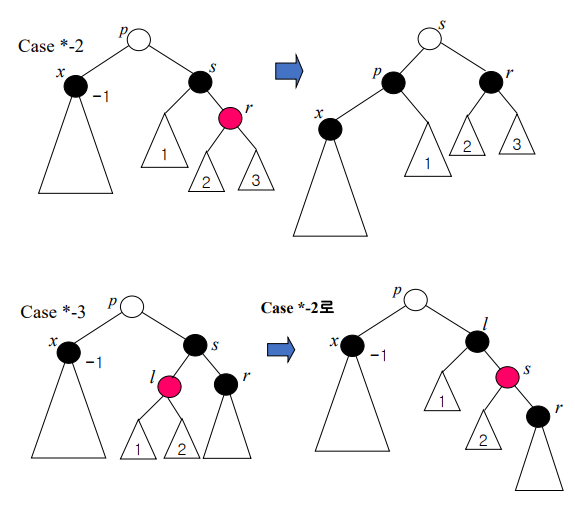

### 루트 노드가 레드 / 블랙 노드 여부가 상관 없는 경우

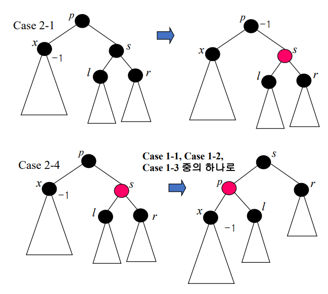
