# 인덱스(Index)

> [참고자료](https://velog.io/@chosj1526/DB-Index-%EA%B0%9C%EB%85%90-%EC%9E%A5%EB%8B%A8%EC%A0%90-%EC%9E%90%EB%A3%8C%EA%B5%AC%EC%A1%B0)
>
> [참고자료 2](https://ajroot5685.github.io/posts/B+-Tree/)
>
> 1절. 인덱스
>
> 2절. 해시 테이블
>
> 3절. B+Tree
>
> 4절. B+Tree의 SELECT, INSERT, DELETE

## 1절. 인덱스

### 인덱스(Index)

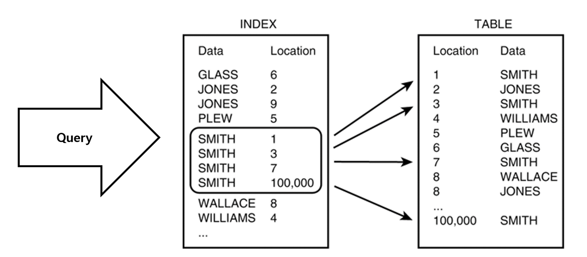

- DB 테이블에 대한 검색 속도를 향상시키는 **자료구조**
    - 해시 테이블
    - B+Tree
- 테이블의 **특정 컬럼**을 정렬해 별도의 저장 공간에 데이터의 물리적 주소와 함께 저장
- 컬럼 값 + 물리적 주소가 한 쌍(key, value)으로 저장
- 원본 테이블은 그대로 두고 검색용 사본 하나 더 생성

### 인덱스 비유

|데이터|인덱스|물리적 주소|
|:---:|:---:|:---:|
|책의 내용|책의 목차|책의 페이지 번호|

### 사용 이유

- 정렬된 구조에서 필요한 위치로 빠르게 접근하는 용도

### 장점

- 조회 속도 향상(풀 테이블 스캔 회피)
- 정렬된 구조로 범위 검색과 ORDER BY에 유리

### 단점

- 추가 저장 공간 필요
- 쓰기 작업 시 인덱스도 갱신되어 비용 증가
- 사용 빈도가 낮거나 중복 값이 많으면 손해

### DML 별 영향

|DML|상황|
|:---:|:---|
|SELECT|조회 속도 향상|
|INSERT|느려짐 : 새 키 값을 정렬 위치에 삽입 필요|
|UPDATE|대상 조회는 빨라지나 인덱스 키 컬럼 수정 시 기존 항목 제거 + 새 위치 삽입|
|DELETE|대상 조회는 빨라지나 인덱스 항목 제거 필요|

### 인덱스 사용이 용이한 경우

- 규모가 큰 테이블
- 데이터의 선택도가 높은(중복 값이 적은) 컬럼
- 조회가 많거나 정렬된 상태가 유용한 컬럼
- WHERE이나 ORDER BY, JOIN 등이 자주 발생하는 컬럼

## 2절. 해시 테이블

### 해시 테이블(Hash Table)

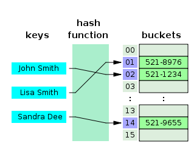

- **(key, value)** 로 데이터를 저장하는 자료구조
    - **(key, value)** = (컬럼 값, 데이터 위치)
- 빠른 데이터 검색 시 유용
- key를 해시 함수에 넣어 버킷 위치 계산
- 평균 O(1)의 매우 빠른 시간에 원하는 데이터 탐색 가능

### 해시 테이블을 기본 구조로 사용하지 않는 이유

- 등호(=) 연산에 최적화된 구조
- 데이터 미정렬로 부등호(<, >) 연산과 범위 검색 불가
- DB는 부등호 연산과 ORDER BY가 빈번

## 3절. B+Tree

### B+Tree

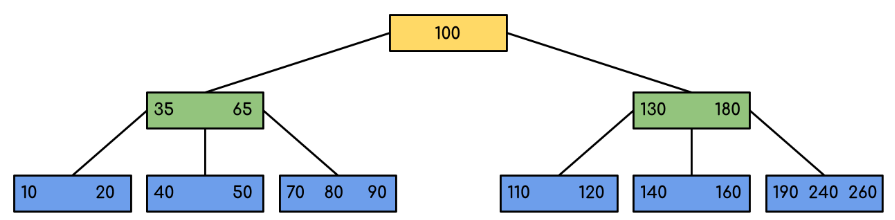

- B-Tree를 개선한 자료구조

### 장점

- 리프 노드에만 행 위치 정보를 저장하므로 중간 노드가 가벼워짐
    - 하나의 node가 많은 포인터를 가져 트리의 높이가 낮아지므로 검색속도 향상
- Full Scan의 경우 리프 노드만 순차 탐색
    - 리프 노드끼리 연결 리스트로 이어져 있어 선형 시간에 전체 순회 가능

### 단점

- 특정 key에 접근하기 위해 리프 노드까지 도달 필요
- 반면 B-Tree는 루트나 중간 노드에도 데이터가 있어 최상의 경우 특정 key를 루트 노드에서 탐색 가능

### B+Tree와 B-Tree의 차이점

- 아래 사진은 B-Tree

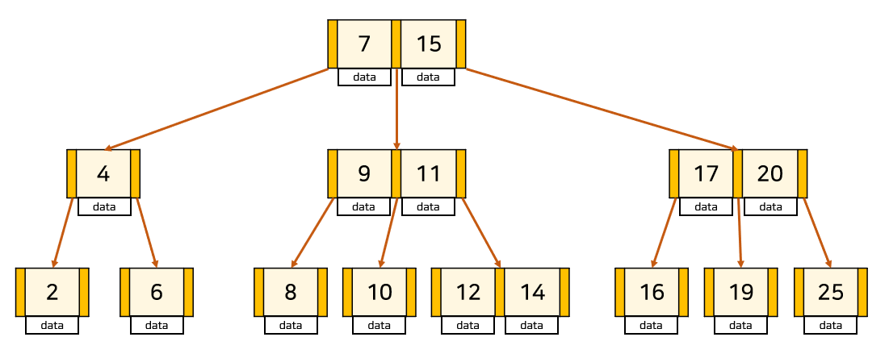

|구분|B+Tree|B-Tree|
|:---:|:---|:---|
|행 위치 정보|리프 노드만 저장|모든 노드가 저장|
|중간 노드 역할|탐색 경로 안내용 키만 보유|키 + 행 위치 정보|
|노드 당 키 개수|중간 노드가 가벼워 더 많이 저장 가능|상대적으로 적음|
|트리 높이|상대적으로 낮음|상대적으로 높음|
|리프 노드 연결|연결 리스트로 연결|X|
|전체 순회|리프 노드만 순차 탐색|모든 노드 방문 필요|
|범위 검색|시작 지점 탐색 후 순차 탐색|비효율적|

### B+Tree 사용 이유

- 인덱스 컬럼은 부등호(<, >)를 이용한 순차 검색 연산이 자주 발생하기 때문
- B+Tree의 연결 리스트로 효율적인 순차 검색 가능

## 4절. B+Tree의 SELECT, INSERT, DELETE

### SELECT

- 단일 key 탐색은 B-Tree와 동일
    - 루트에서 시작해 key 값을 비교하며 리프 노드로 이동
    - 단, B+Tree의 경우 데이터가 리프에만 있어 반드시 리프까지 도달 필요
- 범위 탐색
    - 시작 지점의 리프 노드를 탐색한 후 연결 리스트를 따라 순차 탐색

### INSERT

- B-Tree와 비슷한 로직
- 추가는 항상 리프 노드
- 노드가 넘치는 경우
    - 가운데 key 기준으로 좌우 key들을 분할
    - 가운데 key는 승진

|분할 상황|설명|이유|
|:---:|:---|:---|
|리프 노드 분할|부모에도 자식에도 동시 존재|데이터는 리프 노드에만 존재|
|중간 노드 분할|사본 없이 부모로 이동|중간 노드의 key는 데이터가 아닌 경로 안내용|

### INSERT 예시

> 차수 : 3   
> 45 삽입 시 연쇄적인 분할 발생 예시

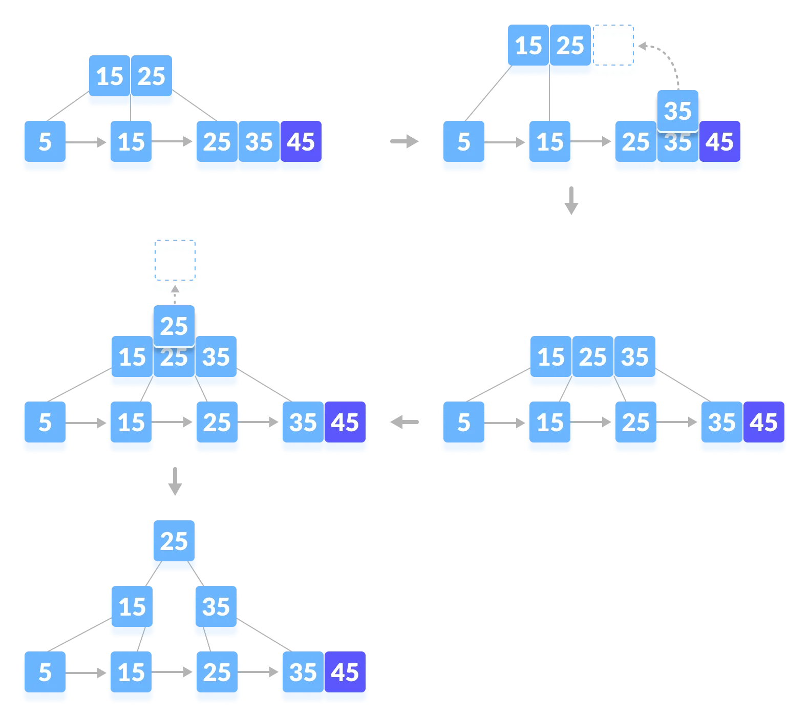

### DELETE

- **B+Tree 조건** 확인 후 재조정
    - M : 최대 자식 수(차수)
    - 노드에는 최대 M개의 자식 존재
    - 노드에는 최대 M - 1개의 Key 존재
    - 노드에는 최소 M / 2개의 자식 노드 존재
    - 루트를 제외한 노드에는 최소 M/2 - 1개의 key 존재
    - 삭제한 키가 internal node의 인덱스로 존재할 경우 다른 key로 대체 필요

### DELETE 예시 1

> 삭제 대상 : 40  
> 삭제할 대상의 인덱스가 없고 재조정이 필요 없는 경우   
> 삭제 후에도 최소 개수 조건을 만족해 재조정이 발생하지 않음 

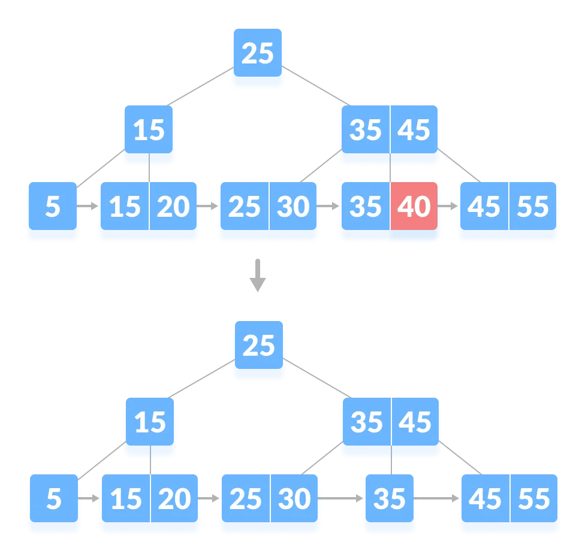

### DELETE 예시 2

> 삭제 대상 : 5   
> 삭제할 대상의 인덱스가 없지만 재조정이 필요한 경우   
> 최소 개수 조건을 만족하지 않아 재조정 발생    
> 형제 노드로부터 데이터를 빌려 조건에 맞게 인덱스 업데이트

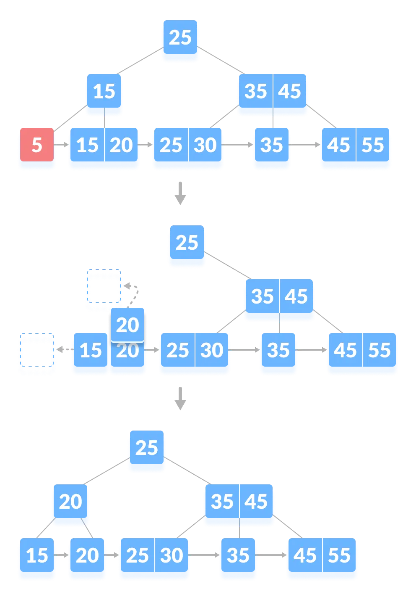

### DELETE 예시 3

> 삭제 대상 : 45   
> 삭제할 대상의 인덱스가 있고 삭제 후 재조정이 필요 없는 경우   
> 최소 개수가 만족되므로 재조정 필요 없음   
> 삭제된 인덱스 대신 같은 노드 안의 key 인덱싱    

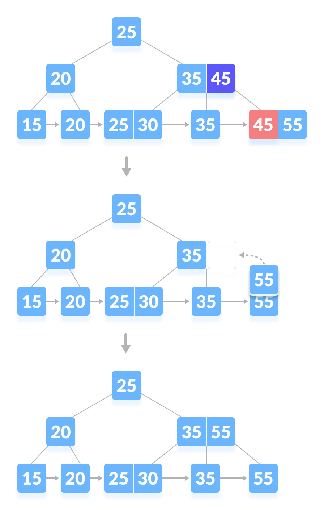

### DELETE 예시 4

> 삭제 대상 : 35   
> 삭제할 대상의 인덱스가 있고 재조정이 필요한 경우    
> 재조정이 발생해 형제 노드로부터 데이터를 빌림    
> 삭제된 인덱스에는 빌린 데이터의 key 인덱싱     

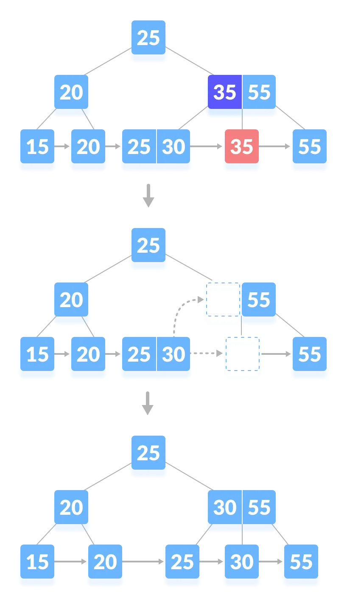

### DELETE 예시 5

> 삭제 대상 : 25     
> 삭제할 대상의 인덱스가 부모 노드이고 재조정이 필요한 경우    
> 리프 노드에서는 형제도 충분한 개수를 가지지 않아 병합 필요    
> 삭제된 인덱스에는 중위 계승자(정렬 순서상 다음 key)로 대체     

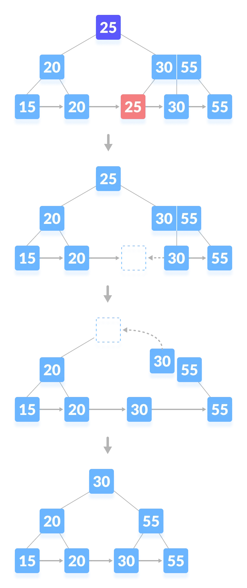

### DELETE 예시 6

> 삭제 대상 : 55    
> 트리의 높이가 줄어드는 경우   
> 55 key와 인덱스 삭제

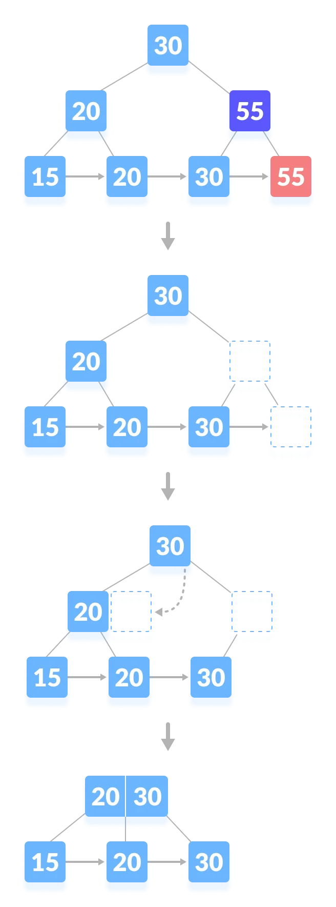

- 리프 노드 재조정
    - 형제 노드로부터 데이터를 빌릴 수 있는지 확인
    - 빌릴 수 없으므로 형제 노드와 병합
- 인덱싱 재조정
    - 형제 노드로부터 인덱스를 빌릴 수 있는지 확인
    - 빌릴 수 없어 부모 노드로부터 빌릴 수 있는지 확인
    - 빌릴 수 없어 부모와 형제 병합

