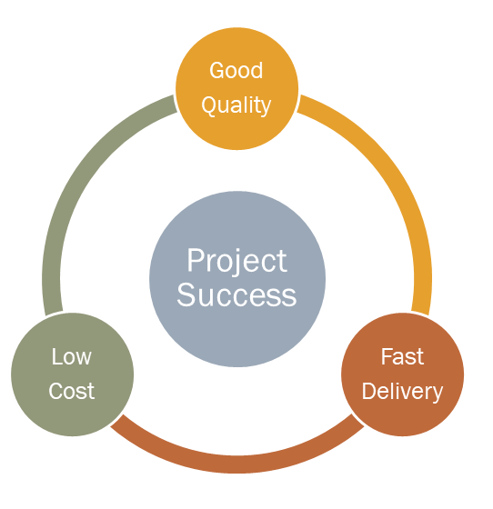

# Software Engineering

> [참고 사이트](https://velog.io/@lmlabs/소프트웨어-공학이란)
>
> 1절. SE
>
> 2절. SE 적용

## 1절. SE

### 소프트웨어 공학(Software Engineering)

- 소프트웨어 생명 주기 전반을 다루는 학문
- 생명 주기 :

### 소프트웨어 공학의 목표

- 품질(Quality)
- 비용(Cost)
- 납기(Delivery)

### 소프트웨어 공학의 특징

- 현장 중심
  - 소프트웨어 공학의 역사가 실무 현장에서 시작
  - 소프트웨어 엔지니어들은 개발 실무에서 접하는 새로운 도전들을 직면 / 다양한 문제점 해결
    - 이 과정에서 나오는 모범 사례들(Best Practice)과 이로 인한 교훈(Lesson Learned) 생성
- 즉, 좋은 원리를 발견 및 적용하여 효과를 보는 것

## 2절. SE 적용
