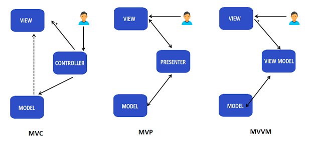

# 아키텍처 패턴

> [참고 자료](https://velog.io/@jackjack/%EC%95%84%ED%82%A4%ED%85%8D%EC%B2%98-%EB%94%94%EC%9E%90%EC%9D%B8-%ED%8C%A8%ED%84%B4-%EC%A0%95%EB%A6%AC)
>
> 1절. 아키텍처 패턴

## 1절. 아키텍처 패턴(Architecture Pattern)

### 개요

- 소프트웨어 시스템의 구조, 조직을 설계하고 관리하는 **원칙**과 **모범 사례**
- 시스템의 다양한 구성 요소와 상호 작용을 **조직화** 및 **최적화**
- 패턴 중 가장 큰 단위
- 디자인 패턴(GoF)보다 상위 층위
  - 디자인 패턴을 재료로 조립

### 목표

|      목표       | 설명                                          |
| :-------------: | :-------------------------------------------- |
|  구조화된 설계  | 논리적 구조화로 역할과 책임 분리              |
| 모듈화 & 재사용 | 코드 재사용성 상승, 독립적인 작업             |
|   느슨한 결합   | 컴포넌트 간 의존성 최소화                     |
|   강한 응집성   | 컴포넌트 내 관련 기능을 묶어 응집성 상승      |
|    유지보수     | 시스템 유지보수 및 확장에 용이                |
|   성능 최적화   | 시스템 성능 향상 및 확장 가능한 아키텍처 구축 |

### 종류

|                  종류                   |         층위         |               의미                | 설명                                                                                                     |
| :-------------------------------------: | :------------------: | :-------------------------------: | :------------------------------------------------------------------------------------------------------- |
| [Layered Architecture](./01_Layered.md) | 애플리케이션 구조 |    **계층화** **아키텍처**     | 각 구성요소들이 '관심사 분리(Separation of Concerns)' 달성을 위한 '책임'을 가진 계층으로 분리된 아키텍처 |
|           [MVC](./02_MVC.md)            | 프레젠테이션 구조 | **Model-View-** **Controller** | Controller가 Model과 View의 중재자 역할을 하는 모델                                                      |
|           [MVP](./03_MVP.md)            | 프레젠테이션 구조 | **Model-View-** **Presenter**  | Presenter를 통해서만 View와 Model의 데이터를 전달하는 모델                                               |
|          [MVVM](./04_MVVM.md)           | 프레젠테이션 구조 | **Model-View-** **ViewModel**  | 데이터 바인딩으로 View와 View Model 사이 의존성이 제거된 모델                                            |

- 층위가 다른 패턴은 서로 배타적이지 않으며 함께 사용
- Layered Architecture의 Presentation 계층을 확대한 것이 MVC, MVP, MVVM
