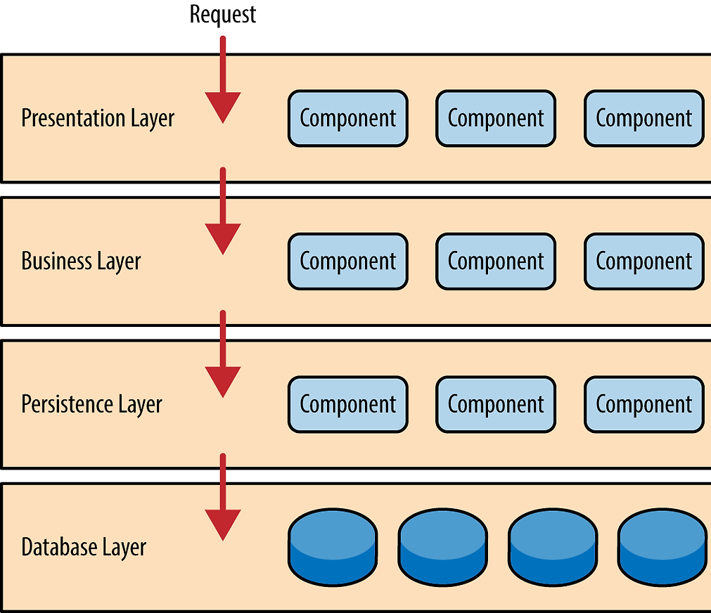

# Layered Architecture

> [참고 자료](https://ksh-coding.tistory.com/92#%F0%9F%8E%AF%201.%C2%A0%20Layered%20Architecture%EB%9E%80%3F-1)
>
> 1절. Layered Architecture
>
> 2절. 의존성
>
> 3절. 계층

## 1절. Layered Architecture

### 계층화 아키텍처

- 각 구성요소들이 '관심사의 분리(Separation of Concerns)' 달성을 위해 '책임'을 가진 계층으로 분리한 아키텍처

### SoC(Separation of Concerns)

- 관심사의 분리
- 소프트웨어 개발에서 가장 기본적인 원칙 중 하나
- 하나의 단일 블록이 아닌 **작은 조각**으로 나눠 간단한 개별 작업을 완료할 수 있도록 만드는 것

### SoC의 이유

- 계층의 응집도 상승
- 계층의 결합도 하락
- 결과적으로 재사용성과 유지보수성 상승

## 2절. 의존성

### 계층화 아키텍처 의존성

- 한 계층에서 자신의 책임 외 행위는 하위 계층에 의존적인 구조
- 하위 계층은 상위 계층에 대한 어떤 지식이나 정보가 없는 구조
- 대부분 3계층 or 4계층으로 구성
  - 3계층 : Persistence -> Business에 흡수 / Database를 시스템 외부로 보고 제외
  - 4계층 : Presentation / Business / Persistence / Database

## 3절. 계층

### Presentation Layer

- 사용자 **요청 및 응답**을 처리하는 책임

| 역할                    |
| :---------------------- |
| Client 요청 수신        |
| 기본적인 요청 내용 검증 |
| 수행 결과 Client 반환   |

### Business Layer

- **비즈니스 로직**을 수행하는 책임

| 역할                        |
| :-------------------------- |
| 비즈니스 로직 수행          |
| Persistence Layer 요청 전송 |
| 전달할 데이터 생성          |

### Persistence Layer

- DB와 **상호작용(CRUD)**하는 책임

| 역할                             |
| :------------------------------- |
| SQL문을 사용해 DB에 저장 및 조회 |

### Database Layer

- DB가 **존재**하는 책임

| 역할         |
| :----------- |
| 실제 DB 위치 |
