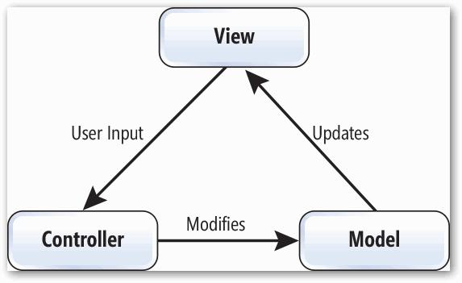

# MVC

> [참고 자료](https://velog.io/@kyeun95/%EB%94%94%EC%9E%90%EC%9D%B8-%ED%8C%A8%ED%84%B4-MVC-%ED%8C%A8%ED%84%B4)
>
> 1절. MVC
>
> 2절. 의존성
>
> 3절. 구성 요소

## 1절. MVC

### MVC 패턴

- Model + View + Controller
- 애플리케이션을 3가지로 구분한 패턴
- 계층화 아키텍처의 Presentation 계층을 역할별로 분리한 패턴

### 장점

- 관심사 분리
- 독립적인 개발과 테스트 가능
- 가독성 및 유지보수성 증가
- 재사용성 및 확장성 증가
- 병렬적 개발 가능

### 단점

- MVC 패턴에 대한 이해 요구
- 여러 파일과 클래스로 분리되어 코드 네비게이션 다수 필요
- 코드 추적 및 디버그에 어려움 발생
- View가 Model을 직접 참조해 규모가 커지면 의존성 완전 분리 불가
- 입력 해석과 분기 로직이 Controller에 집중되어 비대해짐

## 2절. 의존성

### MVC 의존성

- Model은 View와 Controller에 대한 정보가 없는 구조
- View는 Model을 직접 참조하는 구조
- Controller는 Model과 View를 모두 참조하는 구조
- Controller:View는 1:n 관계

### 과정(Process)

1. 사용자의 Action이 View를 통해 입력
2. View가 입력을 Controller에 전달
3. Controller가 입력을 해석해 Model에 상태 변경 요청
4. Model이 비즈니스 로직 수행 후 상태 변경
5. Model이 변경 사실을 View에 전달
6. View가 Model의 데이터를 조회해 화면 갱신

## 3절. 구성 요소

### Model

- 데이터를 처리하는 비즈니스 로직 역할

| 규칙                                      |
| :---------------------------------------- |
| 사용자가 편집하길 원하는 모든 데이터 존재 |
| 뷰나 컨트롤러에 대한 정보 미존재          |
| 변경 발생 시 View에 전달                  |

### View

- 레이아웃과 화면 표시 역할

| 규칙                                  |
| :------------------------------------ |
| Model의 정보를 참조하되 저장 안 함    |
| 컨트롤러에 대한 정보 미존재           |
| Model의 변경 발생 시 조회해 화면 갱신 |

### Controller

- Model과 View를 연결하는 역할

| 규칙                                  |
| :------------------------------------ |
| 모델이나 뷰에 대한 정보 존재          |
| 사용자 입력 해석 후 Model에 요청 전달 |
