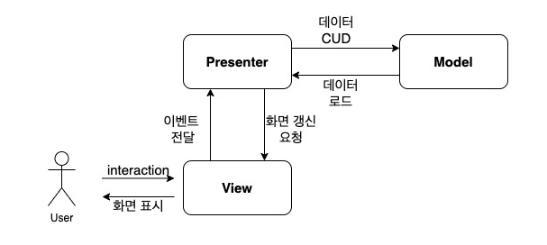

# MVP

> [참고 자료](https://velog.io/@kyeun95/%EB%94%94%EC%9E%90%EC%9D%B8-%ED%8C%A8%ED%84%B4-MVP-%ED%8C%A8%ED%84%B4%EC%9D%B4%EB%9E%80)
>
> 1절. MVP
>
> 2절. 의존성
>
> 3절. 구성 요소

## 1절. MVP

### MVP 패턴

- Model + View + Presenter
- Model은 MVC 패턴과 동일
- MVC의 Controller를 Presenter로 대체
- View와 Model의 직접 참조 차단
- 계층화 아키텍처의 Presentation 계층을 역할별로 분리한 패턴

### 장점

- View와 Model 간 의존성 없음
- UI와 비즈니스 로직 구분으로 유닛 테스트에 용이
- 개발자들 간 협업에 용이
- 코드 분리로 유지보수성과 확장성 향상

### 단점

- View와 Presenter가 1:1 관계이므로 Presenter 재사용 불가
- 기능이 많아지면 Presenter도 거대해짐
- 프로젝트의 규모가 커질수록 MVP 패턴 구조 유지 관리에 어려움
- View가 늘어날 때마다 Presenter도 늘어나 클래스 다량 발생

## 2절. 의존성

### MVP 의존성

- Model은 View와 Presenter에 대한 정보가 없는 구조
- View는 Presenter만 참조하는 구조
- Presenter는 Model과 View를 모두 참조하는 구조
- Presenter:View는 1:1 관계

### 과정(Process)

1. 사용자의 Action이 View를 통해 입력
2. View가 데이터를 Presenter에 전달
3. Presenter는 Model에 데이터 요청(CRUD)
4. Model은 Presenter에서 요청받은 데이터 응답
5. Presenter는 View에게 데이터 응답
6. View는 Presenter가 응답한 데이터로 화면 표시

## 3절. 구성 요소

### Model

- 데이터를 처리하는 비즈니스 로직 역할

| 규칙                                                                |
| :------------------------------------------------------------------ |
| 데이터를 가져오고 저장하는 역할                                     |
| 데이터 소스(데이터베이스, 네트워크 요청, 파일 시스템 등)와 상호작용 |
| View와 Presenter에 대한 정보 미존재                                 |

### View

- 레이아웃과 화면 표시 역할

| 규칙                                |
| :---------------------------------- |
| 사용자 인터페이스 담당              |
| 사용자가 보는 화면 표시             |
| 사용자 입력 처리                    |
| Presenter에 의해 보여질 데이터 표시 |
| 사용자의 행동은 Presenter에 위임    |
| Model에 대한 정보 미존재            |

### Presenter

- Model과 View 사이의 중재자 역할

| 규칙                                            |
| :---------------------------------------------- |
| 사용자 인터페이스 이벤트 감지                   |
| 이벤트를 처리하는 비즈니스 로직 수행            |
| Model과 상호작용해 데이터를 가져오거나 업데이트 |
| View에 데이터 업데이트                          |
| Model과 View에 대한 정보 존재                   |
