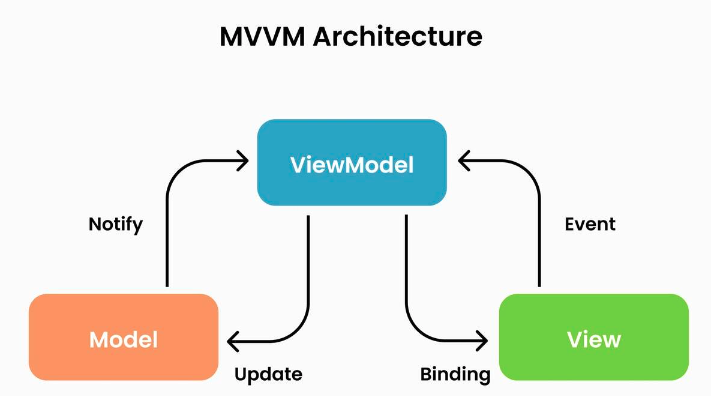

# MVVM

> [참고 자료](https://velog.io/@kyeun95/%EB%94%94%EC%9E%90%EC%9D%B8-%ED%8C%A8%ED%84%B4-MVVM-%ED%8C%A8%ED%84%B4%EC%9D%B4%EB%9E%80)
>
> 1절. MVVM
>
> 2절. 의존성
>
> 3절. 구성 요소

## 1절. MVVM

### MVVM 패턴

- Model + View + ViewModel
- 프로그램의 비즈니스 & 프레젠테이션 로직을 UI로 분리하는 패턴
- Command 패턴 + Data Binding을 통해 View와 ViewModel 사이의 의존성 제거
- ViewModel과 View는 1:n 관계

### 장점

- 뷰 로직과 비즈니스 로직 분리로 생산성 향상
- ViewModel이 View를 몰라 UI 없이 개발 및 단위 테스트 가능
- View와 뷰모델이 1:n 관계이므로 중복 로직을 모듈화해서 여러 뷰에 적용 가능(코드 재사용)

### 단점

- 복잡한 설계
  - RX, 데이터 바인딩에 대한 이해 필요
  - ViewModel 설계의 복잡성
- 뷰 모델이 비대해질 확률 증가
- 데이터 바인딩이 해제되지 않을 경우 메모리 누수 발생

## 2절. 의존성

### MVVM 의존성

- Model은 View와 ViewModel에 대한 정보가 없는 구조
- View는 ViewModel을 Data Binding으로 참조하는 구조
- ViewModel은 View에 대한 정보가 없는 구조
- ViewModel:View는 1:n 관계

### 과정(Process)

1. 사용자의 Action들이 View를 통해 입력
2. View에 Action이 들어올 시 Command 패턴으로 ViewModel에 Action 전달
3. ViewModel이 Model에 데이터 요청
4. Model이 ViewModel에 요청받은 데이터 응답
5. ViewModel이 응답 받은 데이터 가공 후 저장
6. View는 ViewModel과 Data Binding 후 화면 표시

## 3절. 구성 요소

### Model

- 데이터를 처리하는 비즈니스 로직 역할

| 규칙                                                                |
| :------------------------------------------------------------------ |
| 데이터를 가져오고 저장하는 역할                                     |
| 데이터 소스(데이터베이스, 네트워크 요청, 파일 시스템 등)와 상호작용 |
| View와 ViewModel에 대한 정보 미존재                                 |

### View

- 레이아웃과 화면 표시 역할

| 규칙                               |
| :--------------------------------- |
| 사용자 인터페이스를 담당하는 부분  |
| 사용자가 보는 화면 표시            |
| 사용자 입력 처리                   |
| XAML과 비슷한 Markup 언어로 디자인 |
| Model에 대한 정보 미존재           |

### ViewModel

- View와 Model 간 중재자 역할

| 규칙                                       |
| :----------------------------------------- |
| View 이벤트 감지 후 비즈니스 로직 수행     |
| Model과 상호작용 후 View에 데이터 업데이트 |
| View에 표시할 데이터를 가공해 제공         |
| View에 대한 정보 미존재                    |
