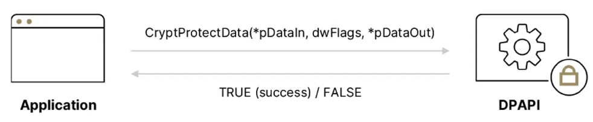
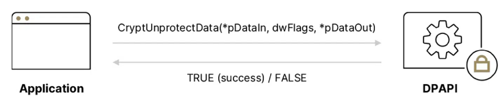
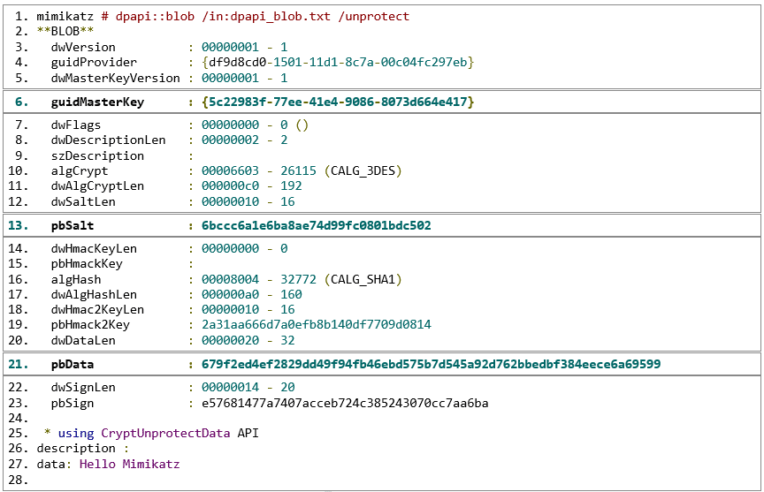

# DPAPI(Data Protection API)

> [참고 사이트](https://www.sygnia.co/blog/the-downfall-of-dpapis-top-secret-weapon/)

## 1절. DPAPI

### DPAPI(데이터 보호 API)

- Windows 애플리케이션에서 널리 사용되는 기능
- 관점 별 차이

|관점|설명|
|:--:|:--|
|앱|개발자가 암호화 알고리즘을 구현하지 않고 **민감 데이터 암호화**|
|내부|알고리즘은 OS(운영체제)가 담당(Vista 이후 AES-256 + SHA-512)|

### DPAPI 암호화 : CryptProtectData

|주요 매개변수|설명|
|:---:|:---|
|*pDataIn|암호화할 평문 데이터에 대한 포인터|
|pOptionalEntropy|선택적 2차 비밀값|
|dwFlags|- 암호화 작업 관련 플래그 - 암호화 범위(사용자 or 로컬)에 대한 세부정보 저장 - 사용자 마스터 키 or 로컬 마스터 키 사용 여부 결정 - 로컬 암호화 시 다른 기기에서 복호화 불가 - CRYPTPROTECT_LOCAL_MACHINE(0x4) => PC의 모든 사용자, 서비스가 복호화 가능|
|*pDataOut|암호화된 결과에 대한 포인터|

### DPAPI 복호화 : CryptUnprotectData

|주요 매개변수|설명|
|:---:|:---|
|*pDataIn|복호화할 암호화된 데이터에 대한 포인터|
|pOptionalEntropy|암호화 시 사용한 경우 복호화 때 필요한 2차 비밀값|
|dwFlags|복호화 시 일반적으로 0 설정|
|*pDataOut|복호화된 평문 데이터에 대한 포인터|

### DPAPI 중요한 값

|값|설명|
|:---:|:---|
|guidMasterKey|암호화할 때 사용된 마스터키의 GUID|
|pbSalt|암호화 작업 시 생성된 솔트값|
|*pbData|실제 암호화된 데이터|

